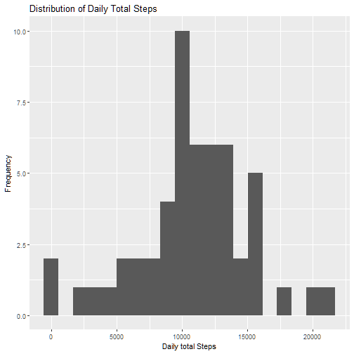
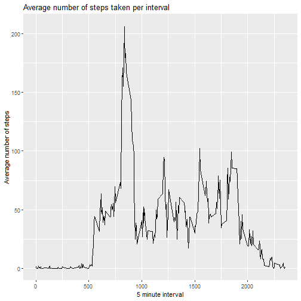
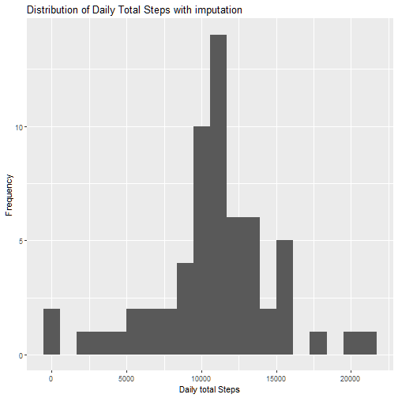
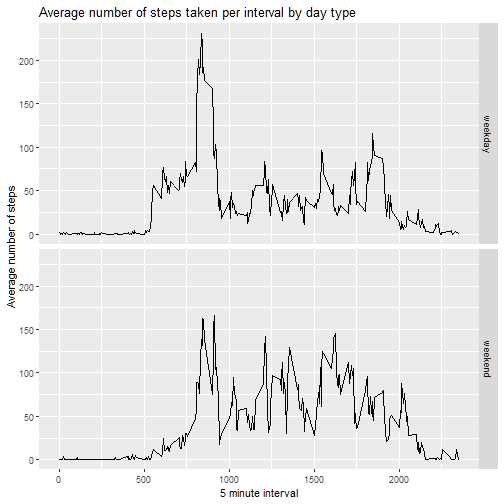

```r
#load necessary libraries
library(lubridate)
library(dplyr)
library(ggplot2)
library(knitr)
```


## Loading and preprocessing the data

```r
fileName <- "activity.zip"

#unzip the file
if (!file.exists("activity.csv")) { 
    unzip(fileName) 
}

#read in activity data
df <- read.csv("activity.csv")

#convert date into POSIXct
df$date <- ymd(df$date)
```


## What is mean total number of steps taken per day?
####Calculate the total number of steps taken per day

```r
#clean version of df with only complete rows
dfclean <- df[!is.na(df$steps),]

#create data frame with total steps taken per day
dftotalPerDay <- dfclean %>% group_by(date) %>%
    summarise(totalSteps = sum(steps))

print(dftotalPerDay)
```

```
## # A tibble: 53 x 2
##    date       totalSteps
##    <date>          <int>
##  1 2012-10-02        126
##  2 2012-10-03      11352
##  3 2012-10-04      12116
##  4 2012-10-05      13294
##  5 2012-10-06      15420
##  6 2012-10-07      11015
##  7 2012-10-09      12811
##  8 2012-10-10       9900
##  9 2012-10-11      10304
## 10 2012-10-12      17382
## # ... with 43 more rows
```

####Make a histogram of the total number of steps taken each day

```r
ggplot(dftotalPerDay, aes(x=totalSteps)) + 
    geom_histogram(bins = 20) +
    xlab("Daily total Steps") +
    ylab("Frequency") +
    ggtitle("Distribution of Daily Total Steps")
```



####Calculate and report the mean and median of the total number of steps taken per day

```r
#mean steps per day
mean(dftotalPerDay$totalSteps)
```

```
## [1] 10766.19
```

```r
#median steps per day
median(dftotalPerDay$totalSteps)
```

```
## [1] 10765
```


## What is the average daily activity pattern?
####Make a time series plot (type = "l") of the 5-minute interval (x-axis) and the average number of steps taken, averaged across all days (y-axis)

```r
# create data frame with average steps taken per interval
dfmeanPerInt <- dfclean %>% group_by(interval) %>%
    summarise(meanSteps = mean(steps))

ggplot(dfmeanPerInt, aes(interval, meanSteps)) +
    geom_line() +
    ylab("Average number of steps") +
    xlab("5 minute interval") +
    ggtitle("Average number of steps taken per interval")
```



####Which 5-minute interval, on average across all the days in the dataset, contains the maximum number of steps?

```r
maxStepsInterval <- dfmeanPerInt %>% filter(meanSteps == max(meanSteps)) %>%
    select(interval)
```

The interval with the maximum number of steps on average is 835.

## Imputing missing values
####Calculate and report the total number of missing values in the dataset (i.e. the total number of rows with NAs)

```r
nrow(df[!complete.cases(df),])
```

```
## [1] 2304
```

####Devise a strategy for filling in all of the missing values in the dataset.
Missing values will be filled in using the mean steps for the given interval which are calculated above in the dfmeanPerInt dataframe.

####Create a new dataset that is equal to the original dataset but with the missing data filled in.

```r
# create copy of original dataset (df) to impute
dfImpute <- df

# impute missing values with mean for the given interval
for (i in 1:nrow(dfImpute)) {
    if(is.na(dfImpute$steps[i])) {
        intervalVal <- dfImpute$interval[i]
        rowVal <- which(dfmeanPerInt$interval == intervalVal)
        imputeVal <- dfmeanPerInt$meanSteps[rowVal]
        dfImpute$steps[i] <- imputeVal
    }
}
```

####Make a histogram of the total number of steps taken each day and Calculate and report the mean and median total number of steps taken per day. 

```r
dftotalPerDayImpute <- dfImpute %>% group_by(date) %>%
    summarise(totalSteps = sum(steps))

ggplot(dftotalPerDayImpute, aes(x=totalSteps)) + 
    geom_histogram(bins = 20) +
    xlab("Daily total Steps") +
    ylab("Frequency") +
    ggtitle("Distribution of Daily Total Steps with imputation")
```



```r
#mean steps per day using imputed data
mean(dftotalPerDayImpute$totalSteps)
```

```
## [1] 10766.19
```

```r
#median steps per day using imputed data
median(dftotalPerDayImpute$totalSteps)
```

```
## [1] 10766.19
```

####Do these values differ from the estimates from the first part of the assignment? 
####What is the impact of imputing missing data on the estimates of the total daily number of steps?
Due to how the imputation was done, the mean values stayed the same at 10766.19. The median rose from 10765 to 10766.19 with the imputation.

## Are there differences in activity patterns between weekdays and weekends?
####Create a new factor variable in the dataset with two levels - "weekday" and "weekend" indicating whether a given date is a weekday or weekend day.

```r
dfImpute$dayType <- weekdays(dfImpute$date)

# iterate through rows of dfImpute to set dayType column to weekend for Saturday and Sunday and weekday for all other days
for (i in 1:nrow(dfImpute)) {
    if(dfImpute$dayType[i] == 'Saturday' || dfImpute$dayType[i] == 'Sunday'){
        dfImpute$dayType[i] <- 'weekend'
    } else {
        dfImpute$dayType[i] <- 'weekday'
    }
}

#change dayType data type to factor
dfImpute$dayType <- as.factor(dfImpute$dayType)
```

####Make a panel plot containing a time series plot of the 5-minute interval (x-axis) and the average number of steps taken, averaged across all weekday days or weekend days (y-axis)

```r
# create dataframe with average steps taken per interval and day type
dfMeanPerDayType <- dfImpute %>% group_by(interval, dayType) %>%
    summarise(meanSteps = mean(steps))

ggplot(dfMeanPerDayType, aes(interval, meanSteps)) +
    geom_line() +
    facet_grid(rows = vars(dayType)) +
    ylab("Average number of steps") +
    xlab("5 minute interval") +
    ggtitle("Average number of steps taken per interval by day type")
```



